# Техническое решение проекта «Название проекта»

## Введение
- **Цель проекта:**  
  Проект направлен на создание многофункционального социально-гибридного приложения. Его ядром является живая карта с реальным временем, вокруг которой строится вся социальная экосистема для друзей, единомышленников и сообществ. Это не просто карта с друзьями, а полноценная социальная сеть.

- **Основания для разработки:**  
  Учебный проект для личного опыта и развития.  

- **Команда:**  
- Болдаков Владимир - Backend-разработчик
- Мефоков Павел - Backend-разработчик
- Павлов Арсений - Frontend-разработчик

---

## Глоссарий
| Термин | Определение |
|---|---|
| Пользователь | Человек, зарегистрированный в приложении, который может общаться, добавлять друзей и создавать контенТ. |
| Профиль | Личная страница пользователя с аватаром, именем, статусом и основной информацией. |
| Друг | Пользователь, с которым установлена двусторонняя связь через систему запросов, дающая доступ к дополнительным функциям общения. |
| Сообщение | Текстовое, голосовое или мультимедийное (фото, видео) содержимое, отправленное в личном или групповом чате. |
| Чат | Закрытое пространство для приватного обмена сообщениями между двумя или более пользователями. |
| Паблик | Открытое сообщество по интересам, куда может вступить любой пользователь для общения и публикации контента. |
| Канал | Личное сообщество человека, состоящее из пользователей, которые им интересуются |
| Подписчик | Пользователь, который подписался на обновления другого пользователя, паблика или канала, чтобы видеть новый контент в своей ленте. |
| Пост | Публикация пользователя или сообщества в ленте, которая может содержать текст, фото, видео и собирать реакции и комментарии. |
| Реакция | Быстрый способ выразить эмоцию к сообщению, посту или комментарию (например, «лайк» или «сердечко»). |
| Комментарий | Текстовый отзыв, оставленный другим пользователем под постом или публикацией. |
| Уведомление | Всплывающее сообщение (push или в приложении), которое информирует пользователя о новом событии: сообщении, запросе в друзья, реакции и т.д. |
| Настройки приватности | Раздел приложения, где пользователь управляет тем, кто и какую информацию из его профиля и активности может видеть. |

---
# Функциональные требования к системе

## 1. Управление аккаунтом и доступ

### 1.1. Регистрация и вход
- **Регистрация:** Создание аккаунта по номеру телефона (уникальный идентификатор), установка уникального никнейма и пароля.
- **Вход в систему:** Авторизация по номеру телефона и паролю.
- **Двухфакторная защита (2FA):** Подтверждение входа через SMS-код или приложение-аутентификатор для защиты от взлома.
- **Восстановление доступа:** Сброс пароля через SMS или привязанный Email в случае утери.

---

## 2. Личный профиль

### 2.1. Редактирование информации
- **Личные данные:** Изменение имени, фамилии, никнейма, города проживания, краткой биографии ("О себе") и даты рождения.
- **Аватар:** Загрузка, кадрирование и удаление фотографии профиля.
- **Статус:** Установка текстового статуса (например, "В отпуске") или статуса активности ("В сети", "Невидимый").

### 2.2. Приватность и Черный список
- **Настройка видимости:** Выбор того, кто видит детальную информацию профиля (Все, Только друзья, Никто).
- **Черный список:** Блокировка нежелательных пользователей. Заблокированный пользователь не может писать сообщения, видеть профиль или статус "В сети".

---

## 3. Друзья и связи

### 3.1. Взаимодействие
- **Поиск людей:** Поиск по точному никнейму.
- **Управление заявками:** Отправка заявок в друзья, принятие входящих, отклонение или игнорирование заявок.
- **Список друзей:** Просмотр списка своих друзей.
- **Удаление:** Удаление пользователя из друзей (разрыв связи).

---

## 4. Каналы (Блоги)

### 4.1. Для подписчика
- **Поиск каналов:** Поиск по названию.
- **Подписка:** Вступление в публичные каналы. Отправка запроса на вступление в закрытые каналы.
- **Уведомления:** Возможность заглушить уведомления (Mute) от конкретного канала, чтобы читать его только при входе в приложение.
- **История:** Доступ к истории публикаций канала, сделанных до момента подписки.

### 4.2. Для владельца канала
- **Создание:** Настройка названия, описания, аватара и типа (публичный/по ссылке).
- **Публикация контента:** Отправка текстовых постов, фото, видео, GIF-анимаций, опросов и файлов.
- **Редактирование:** Возможность изменить текст поста или удалить его (у всех подписчиков).
- **Наказания:** Возможность временно ограничить пользователю право писать или удалить его из сообщества.
- **Управление:** Назначение других пользователей администраторами для помощи в ведении канала.

---

## 5. Паблики (Сообщества)

### 5.1. Для участника
- **Общение:** Возможность писать сообщения в комментарии, отвечать конкретным людям (Reply).
- **Реакции:** Возможность ставить эмодзи-реакции на сообщения других участников или публикации.

### 5.2. Управление сообществом (Модерация)
- **Права доступа:** Настройка того, кто может писать, присылать ссылки или медиафайлы.
- **Наказания:** Возможность временно ограничить пользователю право писать или удалить его из сообщества.
- **Чистка:** Удаление сообщений участников, нарушающих правила.

---

## 6. Мессенджер

### 6.1. Чаты и Сообщения
- **Типы чатов:** Диалоги 1-на-1, группы и "Избранное" (личное хранилище заметок и файлов).
- **Форматы сообщений:** Текст, голосовые сообщения, видео, файлы и фото.
- **Статусы сообщений:** Индикация состояния: "Отправляется" -> "Доставлено" -> "Прочитано".
- **Операции с сообщениями:**
  - **Редактирование:** Исправление текста отправленного сообщения.
  - **Удаление:** Удаление сообщения "У меня" или "У всех участников".
  - **Пересылка:** Пересылка сообщений из одного чата в другой.
  - **Ответ:** Ответ на конкретное сообщение с цитированием.

### 6.2. Звонки
- **Аудио/Видео:** Совершение звонков другим пользователям.
- **Управление звонком:** Включение/выключение камеры и микрофона в процессе разговора.

---

## 7. Геолокация

### 7.1. Карта и местоположение
- **Трансляция геопозиции:** Возможность поделиться своим живым местоположением с другими пользователями с необходимыми правами.
- **Места:** Отметка и сохранение мест (Дом, Работа, Спорт. Зал и т.д.).
- **Взаимодействие с пользователями** Можно видеть живую геолакацию других пользователей при необходимых правах доступа.
---

## 8. Лента и Рекомендации

### 8.1. Лента новостей
- **Сводная лента:** Отображение новых постов из пабликов или каналов, на которые подписан пользователь.

### 8.2. Рекомендации
- **Интересное:** Подборка каналов и пабликов, подходящих по интересам в данный момент или подходящих по географии.

---
## 9. Знакомства и совместимость

### 9.1. Подбор партнеров
- **Анкета интересов:** Заполнение расширенной анкеты (музыка, кино, хобби, цели общения и т.д.).
- **Тесты на совместимость:** Возможность прохождения встроенных психологических тестов или квизов для более точного подбора собеседников.
- **Умный поиск:** Алгоритм подбирает пользователей с высоким процентом совпадения по результатам тестов и интересам.

### 9.2. Взаимодействие
- **Система "Мэтчей":** Механика взаимной симпатии (Лайк/Скип). Возможность начать чат появляется только при взаимном интересе.
- **Фильтры поиска:** Настройка критериев поиска (возраст, расстояние, цель знакомства: дружба, общение, отношения).

## Нефункциональные требования

**1.Производительность и отзывчивость**

**2.Безопасность данных и конфиденциальность**

**3.Масштабируемость архитектуры**

**4.Удобство использования и интуитивный интерфейс**

**5.Надежность и отказоустойчивость**

---

## Пользовательские сценарии

#### **1. Регистрация нового пользователя**
**Предусловия:** Пользователь не зарегистрирован в системе.

**Основной поток:**
1. Пользователь открывает приложение и нажимает "Зарегистрироваться".
2. Пользователь вводит номер телефона (уникальный идентификатор).
3. Система проверяет уникальность номера и отправляет SMS с кодом подтверждения.
4. Пользователь устанавливает уникальный никнейм и пароль.
5. Пользователь вводит полученный код.
6. Система создает учетную запись и базовый профиль пользователя.
7. Пользователь получает доступ к системе.

**Альтернативный поток A (некорректный номер):**
- Если номер телефона уже зарегистрирован, система показывает сообщение: "Данный номер уже используется".

**Альтернативный поток B (истечение времени кода):**
- Если код подтверждения устарел, система предлагает отправить новый код.

---

#### **2. Вход в систему**
**Предусловия:** Пользователь зарегистрирован в системе.

**Основной поток:**
1. Пользователь открывает приложение и нажимает "Войти".
2. Пользователь вводит номер телефона и пароль.
3. Система проверяет корректность данных.
4. Если включена двухфакторная аутентификация (2FA), система отправляет SMS с кодом или запрашивает код из приложения-аутентификатора.
5. Пользователь вводит полученный код.
6. Система подтверждает аутентификацию и предоставляет доступ к системе.

**Альтернативный поток A (неверный пароль):**
- Если пароль введен неверно, система показывает сообщение: "Неверный пароль. Попробуйте снова".
- После 3 неудачных попыток система временно блокирует вход на 15 минут.

**Альтернативный поток B (восстановление доступа):**
- Пользователь нажимает "Забыли пароль?".
- Система предлагает сбросить пароль через SMS-код или привязанный Email.
- Пользователь выбирает способ и следует инструкциям для установки нового пароля.

---

#### **3. Редактирование личного профиля**
**Предусловия:** Пользователь авторизован в системе.

**Основной поток:**
1. Пользователь переходит в раздел "Профиль".
2. Пользователь изменяет данные: имя, фамилия, никнейм, город проживания, дата рождения, о себе, статус.
3. Пользователь нажимает "Сохранить изменения".
4. Система проверяет данные на корректность.
5. Система обновляет информацию профиля.
6. Изменения становятся видимыми другим пользователям в соответствии с настройками приватности.

**Альтернативный поток A (загрузка аватара):**
- Пользователь нажимает "Изменить фото профиля".
- Выбирает изображение из галереи или делает новое фото.
- Использует инструмент кадрирования для настройки изображения.
- Подтверждает выбор, система загружает и устанавливает новое изображение.

---

#### **4. Настройка приватности**
**Предусловия:** Пользователь авторизован в системе.

**Основной поток:**
1. Пользователь переходит в раздел "Настройки" → "Приватность".
2. Для каждого элемента(просмотр профиля, звонков и т.д.) пользователь выбирает уровень доступа: "Все", "Только друзья", "Никто", "Избранные".
3. Пользователь нажимает "Сохранить настройки".
4. Система применяет новые настройки приватности.
5. При попытке взаимодействия с пользователем другими пользователями система проверяет их права доступа.

**Альтернативный поток A (быстрая настройка):**
- Пользователь выбирает готовый шаблон: "Открытый профиль", "Для друзей", "Максимальная приватность".
- Система автоматически применяет соответствующие настройки для всех элементов.


---

#### **5. Управление черным списком**
**Предусловия:** Пользователь авторизован в системе.

**Основной поток:**
1. Пользователь переходит в раздел "Настройки" → "Черный список".
2. Пользователь видит список заблокированных пользователей.
3. Пользователь нажимает "Добавить в черный список".
4. Пользователь вводит никнейм или выбирает из списка друзей/недавних собеседников.
5. Пользователь подтверждает блокировку.
6. Система добавляет пользователя в черный список, разрывает связь друзей (если была).

**Альтернативный поток A (разблокировка):**
- В списке черного списка пользователь нажимает на заблокированного пользователя.
- Выбирает "Разблокировать".
- Система удаляет пользователя из черного списка, восстанавливает возможность взаимодействия.

**Альтернативный поток B (последствия блокировки):**
- После блокировки заблокированный пользователь не может:
  - Отправлять сообщения блокирующему пользователю
  - Видеть статус "В сети" блокирующего
  - Просматривать профиль блокирующего (видит только базовую информацию)
  - Добавлять блокирующего в друзья

---

#### **6. Поиск и добавление в друзья**
**Предусловия:** Пользователь авторизован в системе.

**Основной поток:**
1. Пользователь переходит в раздел "Друзья" → "Поиск людей".
2. Пользователь вводит точный никнейм другого пользователя.
3. Система возвращает результаты поиска (профиль искомого пользователя).
4. Пользователь нажимает "Добавить в друзья" в профиле найденного пользователя.
5. Система отправляет запрос на добавление в друзья.
6. Получатель уведомляется о запросе (push-уведомление и иконка в интерфейсе).
7. Получатель принимает запрос.
8. Пользователи добавляются в друзья (появляются в списке друзей друг у друга).

**Альтернативный поток A (отклонение заявки):**
- Получатель отклоняет запрос на добавление в друзья.
- Отправитель получает уведомление: "Пользователь [никнейм] отклонил вашу заявку в друзья".

**Альтернативный поток B (игнорирование заявки):**
- Получатель не отвечает на заявку в течение 30 дней.
- Система автоматически отклоняет запрос.

---

#### **7. Подписка на канал и чтение контента**
**Предусловия:** Пользователь авторизован в системе.

**Основной поток:**
1. Пользователь переходит в "Поиск".
2. Пользователь вводит название интересующего канала.
3. Система возвращает результаты поиска.
4. Пользователь выбирает канал из списка и просматривает его описание.
5. Пользователь нажимает "Подписаться".
6. Система добавляет канал в список подписок пользователя.
7. Новые посты канала появляются в разделе мессенджера пользователя.
8. Пользователь может просматривать историю публикаций канала.

**Альтернативный поток A (закрытый канал):**
- Если канал закрытый, вместо кнопки "Подписаться" отображается "Запросить доступ".
- После отправки запроса владелец канала получает уведомление и может одобрить/отклонить запрос.

**Альтернативный поток B (отключение уведомлений):**
- После подписки пользователь может нажать "Отключить уведомления" для канала.
- Посты канала будут доступны только при прямом входе в канал, без push-уведомлений.

---

#### **8. Создание и публикация поста в канале**
**Предусловия:** Пользователь авторизован, является владельцем или администратором канала.

**Основной поток:**
1. Пользователь переходит в свой канал.
2. Пользователь нажимает кнопку "Создать пост".
3. Пользователь вводит текст поста, прикрепляет фото/видео/GIF/файлы.
4. Пользователь нажимает "Опубликовать".
5. Пост публикуется в канале и становится виден всем подписчикам или всем, кто смотрит канал неподписанный, в зависимости от приватности канала.

**Альтернативный поток A (редактирование поста):**
- После публикации пользователь может нажать "Редактировать".
- Внести изменения и сохранить их.
- Система обновляет пост у всех подписчиков с пометкой "Отредактировано".

**Альтернативный поток B (удаление поста):**
- Пользователь может удалить пост.
- При выборе "Удалить у всех" пост исчезает у всех подписчиков.
- При выборе "Удалить у меня" пост скрывается только из ленты пользователя.

---

#### **9. Начало чата и отправка сообщения**
**Предусловия:** Пользователь авторизован в системе.

**Основной поток:**
1. Пользователь переходит в раздел "Мессенджер".
2. Пользователь выбирает собеседника из списка друзей или поиска.
3. Пользователь вводит текстовое сообщение.
5. Пользователь нажимает "Отправить".
6. Система показывает статус сообщения: "Доставлено".
7. Когда собеседник открывает чат, статус меняется на "Прочитано".
8. Собеседник может ответить на сообщение.

**Альтернативный поток A (отправка медиафайла):**
- Вместо текста пользователь нажимает на иконку "Скрепка".
- Выбирает фото/видео/файл из устройства.
- Система загружает файл и отправляет его в чат.

**Альтернативный поток B (редактирование сообщения):**
- Пользователь долгим нажатием на отправленное сообщение выбирает "Редактировать".
- Вносит изменения и сохраняет.
- Система помечает сообщение как "Изменено".

---

#### **10. Использование раздела "Знакомства" для поиска партнера**
**Предусловия:** Пользователь авторизован, заполнил анкету интересов.

**Основной поток:**
1. Пользователь переходит в раздел "Знакомства".
2. Система показывает анкету другого пользователя на основе алгоритма рекомендаций.
3. Пользователь просматривает анкету (фото, интересы, результаты тестов на совместимость).
4. Пользователь ставит "Лайк" (симпатия) или "Скип" (пропустить).
5. Если другой пользователь уже поставил "Лайк" текущему пользователю ранее, система создает "Мэтч".
6. Пользователи получают уведомление о взаимной симпатии.
7. Система открывает возможность начать чат.

**Альтернативный поток A (использование фильтров):**
- Пользователь нажимает "Фильтры" перед просмотром анкет.
- Устанавливает критерии: возраст, расстояние, цель знакомства.
- Система показывает только соответствующие фильтрам анкеты.

**Альтернативный поток B (просмотр неограниченного количества анкет):**
- По умолчанию пользователь может просматривать 20 анкет в день.
- За дополнительную плату (премиум-доступ) лимит снимается.

---

#### **11. Совершение аудио/видеозвонка**
**Предусловия:** Пользователь авторизован, собеседник в друзьях или в чате.

**Основной поток:**
1. Пользователь открывает чат с собеседником.
2. Пользователь нажимает иконку "Телефон" (аудиозвонок) или "Видеокамера" (видеозвонок).
3. Система отправляет собеседнику запрос на звонок, если обладает соответствующими правами доступа.
4. Собеседник принимает звонок.
5. Устанавливается соединение, пользователи могут общаться.
6. Во время звонок пользователь может включать/выключать микрофон или камеру.
7. Один из пользователей завершает звонок.

**Альтернативный поток A (отклонение звонка):**
- Собеседник отклоняет входящий звонок.
- Инициатор получает уведомление: "Пользователь не ответил".


---
#### **12. Взаимодействие с картой и геолокацией**
**Предусловия:** Пользователь авторизован в системе, разрешил доступ к геолокации.

**Основной поток (трансляция своего местоположения):**
1. Пользователь открывает раздел "Карта".
2. Пользователь выбирает, с кем делиться (конкретный друг, несколько друзей, все друзья).
3. Система начинает непрерывную передачу геопозиции пользователя выбранным пользователям.
4. Выбранные друзья видят перемещение пользователя на карте в реальном времени.

**Альтернативный поток A (просмотр друзей на карте):**
- Пользователь открывает раздел "Карта".
- Система показывает метки друзей, которые транслируют свое местоположение и дали на это разрешение.
- Пользователь может нажать на метку друга, чтобы увидеть его имя, расстояние и время последнего обновления.

**Альтернативный поток B (сохранение мест):**
- Пользователь долгим нажатием на карту создает метку в нужном месте.
- Пользователь выбирает "Сохранить место".
- Задает название (Дом, Работа, Любимое кафе) и категорию.
- Система сохраняет место в личном списке пользователя.
- В будущем пользователь может быстро поделиться этой локацией в чате.

---

#### **13. Вступление в паблик и участие в обсуждениях**
**Предусловия:** Пользователь авторизован в системе.

**Основной поток (открытый паблик):**
1. Пользователь переходит в раздел "Сообщества".
2. Пользователь ищет паблик по интересам (например, "Фотография", "Автомобили") или названию.
3. Пользователь выбирает паблик из результатов поиска, просматривает описание.
4. Пользователь нажимает "Вступить в сообщество".
5. Система добавляет пользователя в паблик.
6. Пользователь видит ленту обсуждений паблика и может участвовать в них.
7. Пользователь при должных правах доступа может видеть подписчиков паблика и похожие на него другие паблики.

**Альтернативный поток A (закрытый паблик, отправка заявки):**
- Если паблик закрытый, вместо кнопки "Вступить в сообщество" отображается "Подать заявку".
- Пользователь нажимает "Подать заявку".
- Система отправляет запрос администраторам паблика.
- Пользователь видит статус "Заявка отправлена, ожидайте решения".
- Администратор паблика получает уведомление о новой заявке.
- Администратор просматривает профиль пользователя и принимает решение: "Принять" или "Отклонить".
- Если администратор одобряет заявку:
  - Система добавляет пользователя в паблик.
  - Пользователь получает уведомление: "Ваша заявка в паблик [Название] одобрена".
  - Пользователь получает доступ к паблику.
- Если администратор отклоняет заявку:
  - Пользователь получает уведомление: "Ваша заявка в паблик [Название] отклонена" (с возможностью указания причины или без).


**Альтернативный поток B (комментирование в паблике):**
- В ленте паблика пользователь выбирает интересующее обсуждение.
- Пользователь нажимает "Комментировать".
- Написывает текст, может прикрепить фото/видео/GIF/файлы.
- Нажимает "Отправить".
- Комментарий появляется в обсуждении, другие участники могут отвечать.

**Альтернативный поток C (ответ на конкретный комментарий):**
- Пользователь нажатием на комментарий другого участника выбирает "Ответить".
- Система цитирует исходный комментарий.
- Пользователь пишет свой ответ и отправляет.

**Альтернативный поток D (использование реакций):**
- Пользователь может нажать на иконку "Эмодзи" под постом или комментарием.
- Выбрать одну или несколько реакций (👍, ❤️, 😂 и т.д.).
- Система учитывает реакцию, общее количество и список реакций видны всем участникам.

---

#### **14. Создание и управление пабликом (сообществом)**
**Предусловия:** Пользователь авторизован, имеет право создавать сообщества.

**Основной поток (создание паблика):**
1. Пользователь переходит в раздел "Сообщества" → "Создать паблик".
2. Пользователь вводит название, описание, выбирает тематику (категорию).
3. Пользователь загружает аватар сообщества.
4. Пользователь выбирает тип паблика: открытый (вступление автоматически) или закрытый (требуется одобрение заявки).
5. Пользователь устанавливает основные правила сообщества.
6. Пользователь нажимает "Создать".
7. Система создает паблик, пользователь становится его создателем и администратором.

**Альтернативный поток A (модерация контента):**
- Администратор или модератор видит комментарий, нарушающий правила.
- Нажимает на комментарий, выбирает действие: "Удалить".


---

#### **15. Управление участниками в паблике**
**Предусловия:** Пользователь является администратором или модератором паблика.

**Основной поток (временное ограничение прав):**
1. Администратор заходит в профиль участника паблика.
2. Нажимает "Ограничить права".
3. Выбирает тип ограничения: запрет на комментирование, запрет на создание тем, полный запрет участия.
4. Устанавливает срок ограничения (1 день, 3 дня, 1 неделя, 1 месяц, навсегда).
5. Указывает причину (опционально).
6. Подтверждает действие.
7. Система применяет ограничение, участник получает уведомление.

**Альтернативный поток A (рассмотрение заявок на вступление):**
- Для закрытого паблика администратор переходит в "Уведомления".
- Просматривает список желающих вступить, может открыть их профили.
- По каждому пользователю принимает решение: "Принять" или "Отклонить".
- При отклонении может указать причину (опционально).

**Альтернативный поток B (удаление участника из паблика):**
- Администратор выбирает участника в списке членов паблика.
- Нажимает "Исключить из сообщества".
- Подтверждает действие.
- Система удаляет пользователя из паблика, он теряет доступ ко всем обсуждениям.

---
##  Архитектура системы

```mermaid
graph TB
    subgraph Клиент
        WEB[Веб-клиент<br/>React]
    end

    subgraph "API Gateway (Go)"
        GW[API Gateway<br/>Kong/Traefik]
    end

    subgraph "Go-сервисы (Павел)"
        AUTH[Auth Service - Go]
        PROFILE[Profile Service - Go]
        FRIENDS[Friends Service - Go]
        NOTIFY[Notification Service - Go]
        MEDIA[Media Service - Go]
        COMMUNITY[Community Service - Go]
    end

    subgraph "Python-сервис (Павел)"
        ML[ML Service - Python<br/>Recommendations]
    end

    subgraph "C++-сервисы (Владимир)"
        CHAT[Chat Service - C++]
        CHANNEL[Channel Service - C++]
        MAPS[Maps Service - C++]
        DATING[Dating Service - C++]
        FEED[Feed Service - C++]
        CALL[Call Service - C++]
        SEARCH[Search Service - C++]
    end

    subgraph "PostgreSQL (Database-per-service)"
        AUTH_DB[(Auth DB)]
        PROFILE_DB[(Profile DB)]
        FRIENDS_DB[(Friends DB)]
        NOTIFY_DB[(Notify DB)]
        MEDIA_DB[(Media DB)]
        COMMUNITY_DB[(Community DB)]
        ML_DB[(ML DB)]
        CHAT_DB[(Chat DB)]
        CHANNEL_DB[(Channel DB)]
        MAPS_DB[(Maps DB<br/>PostGIS)]
        DATING_DB[(Dating DB)]
        FEED_DB[(Feed DB)]
        CALL_DB[(Call DB)]
        SEARCH_DB[(Search DB)]
    end

    subgraph "Redis (Cache-per-service)"
        AUTH_REDIS[(Auth Redis)]
        PROFILE_REDIS[(Profile Redis)]
        FRIENDS_REDIS[(Friends Redis)]
        NOTIFY_REDIS[(Notify Redis)]
        MEDIA_REDIS[(Media Redis)]
        COMMUNITY_REDIS[(Community Redis)]
        ML_REDIS[(ML Redis)]
        CHAT_REDIS[(Chat Redis)]
        CHANNEL_REDIS[(Channel Redis)]
        MAPS_REDIS[(Maps Redis)]
        DATING_REDIS[(Dating Redis)]
        FEED_REDIS[(Feed Redis)]
        CALL_REDIS[(Call Redis)]
        SEARCH_REDIS[(Search Redis)]
    end

    subgraph "Топики Kafka (тематические)"
        K_UL[user-lifecycle]
        K_SG[social-graph]
        K_CC[content-channel]
        K_CM[content-community]
        K_MSG[messaging]
        K_LOC[location]
        K_DT[dating]
        K_CALL[calls]
        K_MEDIA[media]
    end

    subgraph "Внешние интеграции"
        SMS[SMS-провайдер]
        EMAIL[Email-сервис]
        PUSH[Push-уведомления]
        MAPS_API[Картографический API]
        S3[Облачное хранилище<br/>S3-compatible]
    end

    %% Потоки от клиента
    WEB --> GW

    %% Маршрутизация Gateway -> Сервисы
    GW --> AUTH
    GW --> PROFILE
    GW --> FRIENDS
    GW --> NOTIFY
    GW --> MEDIA
    GW --> COMMUNITY
    GW --> ML
    GW --> CHAT
    GW --> CHANNEL
    GW --> MAPS
    GW --> DATING
    GW --> FEED
    GW --> CALL
    GW --> SEARCH

    %% Связи сервисов со своими БД
    AUTH --> AUTH_DB
    PROFILE --> PROFILE_DB
    FRIENDS --> FRIENDS_DB
    NOTIFY --> NOTIFY_DB
    MEDIA --> MEDIA_DB
    COMMUNITY --> COMMUNITY_DB
    ML --> ML_DB
    CHAT --> CHAT_DB
    CHANNEL --> CHANNEL_DB
    MAPS --> MAPS_DB
    DATING --> DATING_DB
    FEED --> FEED_DB
    CALL --> CALL_DB
    SEARCH --> SEARCH_DB

    %% Per-service Redis (Cache -> DB)
    AUTH --> AUTH_REDIS
    PROFILE --> PROFILE_REDIS
    FRIENDS --> FRIENDS_REDIS
    NOTIFY --> NOTIFY_REDIS
    MEDIA --> MEDIA_REDIS
    COMMUNITY --> COMMUNITY_REDIS
    ML --> ML_REDIS
    CHAT --> CHAT_REDIS
    CHANNEL --> CHANNEL_REDIS
    MAPS --> MAPS_REDIS
    DATING --> DATING_REDIS
    FEED --> FEED_REDIS
    CALL --> CALL_REDIS
    SEARCH --> SEARCH_REDIS

    %% Публикация событий в Kafka (Producer -> Topic)
    AUTH -- "user.registered, user.2fa" --> K_UL
    PROFILE -- "profile.updated, privacy.changed" --> K_UL
    FRIENDS -- "friend.request, friend.accepted, friend.removed" --> K_SG
    COMMUNITY -- "community.post, community.comment, community.reaction" --> K_CM
    CHANNEL -- "channel.post, channel.subscribe" --> K_CC
    CHAT -- "message.sent, message.read, chat.created" --> K_MSG
    MAPS -- "location.updated, place.saved" --> K_LOC
    DATING -- "match.created, like, skip" --> K_DT
    CALL -- "call.started, call.ended" --> K_CALL
    MEDIA -- "media.uploaded, media.processed" --> K_MEDIA
    ML -- "recommendation.updated" --> K_UL
    ML -- "recommendation.updated" --> K_CC
    ML -- "recommendation.updated" --> K_DT

    %% Потребление событий из Kafka (Topic -> Consumer)
    K_UL --> NOTIFY
    K_UL --> FEED
    K_UL --> ML
    K_UL --> SEARCH
    K_SG --> NOTIFY
    K_SG --> CHAT
    K_SG --> DATING
    K_CC --> NOTIFY
    K_CC --> FEED
    K_CC --> ML
    K_CC --> SEARCH
    K_CM --> NOTIFY
    K_CM --> FEED
    K_CM --> ML
    K_CM --> SEARCH
    K_MSG --> NOTIFY
    K_MSG --> CHAT
    K_LOC --> NOTIFY
    K_LOC --> DATING
    K_LOC --> FEED
    K_DT --> NOTIFY
    K_DT --> CHAT
    K_DT --> ML
    K_CALL --> NOTIFY
    K_MEDIA --> NOTIFY

    %% Внешние интеграции
    NOTIFY --> SMS
    NOTIFY --> EMAIL
    NOTIFY --> PUSH
    MAPS --> MAPS_API
    MEDIA --> S3

    %% Стили
    classDef gateway fill:#e0f7fa,stroke:#00bcd4,stroke-width:2px
    classDef go fill:#e3f2fd,stroke:#2196f3,stroke-width:2px
    classDef python fill:#d4edc9,stroke:#28a745,stroke-width:2px
    classDef cpp fill:#fff3e0,stroke:#ff9800,stroke-width:2px
    classDef db fill:#f3e5f5,stroke:#9c27b0,stroke-width:2px
    classDef redis fill:#fff9c4,stroke:#fbc02d,stroke-width:2px
    classDef kafka fill:#fbe9e7,stroke:#ff5722,stroke-width:2px
    classDef external fill:#e8f5e8,stroke:#4caf50,stroke-width:2px

    class GW gateway
    class AUTH,PROFILE,FRIENDS,NOTIFY,MEDIA,COMMUNITY go
    class ML python
    class CHAT,CHANNEL,MAPS,DATING,FEED,CALL,SEARCH cpp
    class AUTH_DB,PROFILE_DB,FRIENDS_DB,NOTIFY_DB,MEDIA_DB,COMMUNITY_DB,ML_DB,CHAT_DB,CHANNEL_DB,MAPS_DB,DATING_DB,FEED_DB,CALL_DB,SEARCH_DB db
    class AUTH_REDIS,PROFILE_REDIS,FRIENDS_REDIS,NOTIFY_REDIS,MEDIA_REDIS,COMMUNITY_REDIS,ML_REDIS,CHAT_REDIS,CHANNEL_REDIS,MAPS_REDIS,DATING_REDIS,FEED_REDIS,CALL_REDIS,SEARCH_REDIS redis
    class K_UL,K_SG,K_CC,K_CM,K_MSG,K_LOC,K_DT,K_CALL,K_MEDIA kafka
    class SMS,EMAIL,PUSH,MAPS_API,S3 external
```

---


### Ключевые принципы построения

- **gRPC** — основной протокол для синхронного взаимодействия между микросервисами (быстро, строгий контракт, поддержка стримов).
- **Apache Kafka** — асинхронная шина событий, обеспечивает слабую связность и устойчивость к пиковым нагрузкам.
- **Redis** — сверхбыстрое кэширование «горячих» данных (сессии, профили, права доступа, геопозиция, счётчики).
- **C++** — для сервисов с экстремальными требованиями к производительности (чат, каналы, карты, знакомства, лента, поиск, звонки).
- **Go** — для сервисов со средней нагрузкой, где важна простота разработки и хорошая работа с сетью (авторизация, профили, друзья, уведомления, медиа, сообщества).
- **Database-per-service** — каждый сервис владеет своей БД (PostgreSQL), при необходимости шардирование и партиционирование.
- **API Gateway** — единая точка входа, валидация JWT, маршрутизация, преобразование REST → gRPC.

---

# Технические сценарии

```markdown
# Техническое решение проекта «Многофункциональное социально-гибридное приложение»

## Архитектура системы


---

# Технические сценарии

## 1. Регистрация нового пользователя

**Участники:**  
Клиент → API Gateway → Auth Service (Go) → SMS-провайдер, Profile Service (Go), Kafka (топик `user-lifecycle`).

**Последовательность:**

1. **Клиент** отправляет номер телефона (`POST /api/v1/auth/register`).  
   API Gateway преобразует запрос в **gRPC** `AuthService.Register`.

2. **Auth Service**:
   - Проверяет уникальность номера в **Auth DB** (PostgreSQL, индекс `phone`).
   - Генерирует 6-значный код, сохраняет в **Auth Redis** (ключ `sms_code:{phone}`, TTL 5 мин).
   - Асинхронно отправляет SMS (worker pool, не блокирует ответ).

3. **Клиент** вводит код → `POST /api/v1/auth/verify` → gRPC `AuthService.VerifyCode`.
   - Проверка кода в Redis, удаление после успеха.
   - Создание записи пользователя со статусом `pending`, выдача временного JWT.

4. **Клиент** завершает регистрацию (никнейм, пароль):
   - Проверка уникальности никнейма, хеширование пароля (bcrypt).
   - Перевод статуса в `active`.
   - **Публикация события** `user.registered` в Kafka.

5. **Profile Service** (подписчик Kafka):
   - Создаёт пустой профиль в **Profile DB**.
   - Кэширует профиль в **Profile Redis** (ключ `profile:{user_id}`, TTL 1ч).

**Оптимизации:**
- Пул соединений с БД и Redis.
- Индексы на `phone`, `nickname`.
- Отправка SMS асинхронно, не задерживая ответ.
- JWT валидируется на Gateway (без обращения к сервису).

---

## 2. Вход в систему

**Участники:**  
Клиент → API Gateway → Auth Service (Go), Profile Service, Kafka.

**Последовательность:**

1. **Клиент** → `POST /api/v1/auth/login` (телефон, пароль) → gRPC `AuthService.Login`.
2. **Auth Service**:
   - Поиск пользователя по телефону, проверка пароля (bcrypt).
   - Если **2FA** включена: генерация кода, сохранение в Redis, отправка SMS/Email → ответ `2FA_REQUIRED`.
   - Иначе: создание **JWT access token** (15 мин) и **refresh token** (7 дней). Refresh token хранится в Redis (`refresh:{user_id}`).
3. При каждом запросе клиент прикрепляет JWT. API Gateway проверяет подпись без обращения к сервисам.
4. **Публикация** `user.logged_in` в Kafka (статистика, статус «в сети»).

**Оптимизация:**
- Валидация JWT на Gateway (нет лишних gRPC-вызовов).
- Refresh token проверяется через Redis (быстро).
- Счётчик неудачных попыток в Redis, временная блокировка при превышении.

---

## 3. Редактирование личного профиля

**Участники:**  
Клиент → API Gateway → Profile Service (Go) → Profile DB, Profile Redis, Media Service (Go), S3, Kafka.

**Последовательность:**

1. **Клиент** → `PATCH /api/v1/profile` → gRPC `ProfileService.UpdateProfile`.
2. **Profile Service**:
   - Изменение данных: проверка уникальности никнейма (если меняется).
   - Если загружается **аватар**:
     - Клиент получает подписанный URL от **Media Service** и загружает файл напрямую в S3.
     - После загрузки клиент подтверждает, Profile Service обновляет ссылку в БД.
     - **Media Service** асинхронно обрабатывает изображение (ресайз, WebP) и сохраняет превью.
   - Обновление записи в **Profile DB**, **инвалидация кэша** в Redis (удаление ключа `profile:{user_id}`).
   - **Публикация** `profile.updated` в Kafka.
3. Подписчики: **Search Service** (переиндексация), **Dating Service** (обновление анкеты) и др.

**Почему так:**
- Прямая загрузка в S3 разгружает сервисы.
- Инвалидация кэша гарантирует актуальность данных.
- Асинхронная обработка медиа не замедляет ответ.

---

## 4. Настройка приватности

**Участники:**  
Клиент → Profile Service (Go) → Profile DB, Redis, Kafka.

**Последовательность:**

1. **Клиент** → `PUT /api/v1/privacy` → gRPC `ProfileService.SetPrivacy`.
2. **Profile Service**:
   - Сохраняет настройки в JSONB-поле в **Profile DB**.
   - Обновляет кэш в Redis: `privacy:{user_id}` (JSON, TTL 1ч).
3. **Проверка прав** при любом действии (друзья, чат, карта):
   - Сервис-потребитель вызывает `ProfileService.CheckPermission`.
   - Profile Service сначала смотрит Redis → если есть, мгновенный ответ.
   - Иначе читает БД, кэширует и отвечает.

**Оптимизация:**
- Кэширование настроек приватности (частые проверки).
- Pipeline Redis для массовых проверок (например, для отображения 100 друзей на карте).

---

## 5. Управление черным списком

**Участники:**  
Клиент → Friends Service (Go) → Friends DB, Redis, Kafka.

**Последовательность:**

1. **Клиент** → `POST /api/v1/blacklist` → gRPC `FriendsService.BlockUser`.
2. **Friends Service**:
   - Проверка, не заблокирован ли уже.
   - Запись в таблицу `blocked_users` (user_id, blocked_user_id).
   - Если были друзья — удаление связи.
   - **Добавление в Redis SET** `blocked:{user_id}` (ID заблокированных).
3. При любом взаимодействии (сообщение, просмотр профиля) сервис вызывает `FriendsService.IsBlocked`. Friends Service отвечает по Redis (O(1) — `SISMEMBER`).
4. **Разблокировка** → удаление из БД и Redis SET.

**Почему Redis:**
- Проверка блокировки нужна на **каждое действие** — крайне часто.
- Redis SET даёт мгновенный ответ без нагрузки на БД.

---

## 6. Поиск и добавление в друзья

**Участники:**  
Клиент → Search Service (C++), Friends Service (Go), Profile Service (Go), Kafka.

**Последовательность:**

1. **Поиск** пользователя по никнейму: `GET /api/v1/search/users?q=...`.
   - **Search Service** (C++) на базе **Tantivy** (Rust-движок, встраивается в C++).
   - Индекс обновляется через Kafka (события `profile.updated`, `user.registered`).
   - Возвращает ранжированный список найденных профилей.

2. **Отправка заявки в друзья**: `POST /api/v1/friends/requests`.
   - **Friends Service** проверяет блокировки, дубликаты.
   - Запись в таблицу `friend_requests` (status=pending).
   - Публикация `friend.request.sent` в Kafka.

3. **Принятие заявки**: `POST /api/v1/friends/requests/{id}/accept`.
   - Friends Service меняет статус, создаёт запись в `friends`.
   - Публикует `friend.accepted`.
   - Подписчики: Dating Service (исключают друзей из рекомендаций), Chat Service (опционально создаёт чат).

**Оптимизация:**
- Поиск на C++ — максимальная скорость.
- Уникальный индекс `(from, to)` в БД предотвращает дубли заявок.

---

## 7. Подписка на канал и чтение контента

**Участники:**  
Клиент → Channel Service (C++) → Channel DB, Redis, Kafka.

**Последовательность:**

1. **Подписка** → gRPC `ChannelService.Subscribe`.
   - Проверка, не подписан ли уже.
   - Запись в таблицу `subscriptions`.
   - **Добавление user_id в Redis SET** `subscribers:{channel_id}` (быстрый подсчёт и проверка).
   - Публикация `channel.subscribe` в Kafka.

2. **Чтение постов**:
   - Channel Service отдаёт посты из **кэша Redis**:
     - Sorted Set `channel_posts:{channel_id}` хранит ID постов по времени.
     - Hash `post:{post_id}` содержит сам пост.
   - При промахе — чтение из БД и заполнение кэша.

**Почему C++?**
- Каналы могут иметь миллионы подписчиков.
- Операции подписки/отписки должны быть быстрыми.
- Redis SET и Sorted Set работают за O(log N).

---

## 8. Создание и публикация поста в канале

**Участники:**  
Клиент → Channel Service (C++), Media Service (Go), S3, Kafka, Feed Service (C++), Notification Service.

**Последовательность:**

1. **Подготовка медиа** (опционально):
   - Клиент получает подписанные URL от Media Service, загружает файлы в S3.

2. **Создание поста**: `POST /api/v1/channels/{id}/posts` → gRPC `ChannelService.CreatePost`.
   - Проверка прав (админ/владелец) через Redis `channel_admins:{channel_id}`.
   - Сохранение поста в **Channel DB**, кэширование в Redis.
   - Добавление ID поста в sorted set канала.
   - **Публикация** `channel.post` в Kafka.

3. **Feed Service** (C++):
   - Получает событие, для **онлайн-подписчиков** доставляет пост через WebSocket/gRPC-стрим.
   - Для **офлайн** — добавляет ID поста в персонализированную ленту в ClickHouse.

4. **Notification Service** отправляет push-уведомления подписчикам (с учётом настроек muting).

**Оптимизация:**
- Push для онлайн, pull для офлайн (гибридная модель).
- Для «супер-каналов» — шардирование подписчиков.

---

## 9. Начало чата и отправка сообщения

**Участники:**  
Клиент → Chat Service (C++), Chat DB, Redis, Kafka, Notification Service.

**Последовательность:**

1. **Установка соединения**:
   - WebSocket или gRPC-бидирекциональный стрим.
   - Chat Service регистрирует канал в локальной памяти (`user_connections`).

2. **Отправка сообщения**:
   - Валидация (длина, фильтр спама — кольцевой фильтр Блума на C++).
   - Проверка прав: является ли участником чата? Проверка по Redis SET `chat_members:{chat_id}`.
   - Асинхронное сохранение в **Chat DB** (партиционирование по `chat_id`).
   - **Увеличение счётчика непрочитанных** в Redis (`unread:{user_id}:{chat_id}`, атомарный INCR).
   - Рассылка онлайн-участникам (локально или через gRPC на другие инстансы).
   - Публикация `message.sent` в Kafka.

3. **Обновление статуса «прочитано»**:
   - Клиент отправляет `ReadReceipt`.
   - Сброс счётчика непрочитанных в Redis, обновление в БД.

**Почему C++:**
- Десятки тысяч сообщений/сек.
- epoll/io_uring, минимальные накладные расходы.
- Блум-фильтр на C++ работает очень быстро.

---

## 10. Использование раздела «Знакомства» для поиска партнёра

**Участники:**  
Клиент → Dating Service (C++), ML Service (Python), Dating DB, Redis, Kafka.

**Последовательность:**

1. **Загрузка анкеты**:
   - Клиент запрашивает `GET /api/v1/dating/candidates`.
   - Dating Service вызывает gRPC `MLService.GetRecommendations`.
   - ML Service использует **предвычисленные рекомендации** в Redis (sorted set `recs:{user_id}`), обновляемые раз в час.
   - Возвращает список user_id, Dating Service дополняет данными профиля.

2. **Лайк**: `POST /api/v1/dating/like`.
   - Проверка дневного лимита в Redis (`likes_today:{user_id}`, TTL 24ч, INCR).
   - Сохранение лайка в БД.
   - **Проверка взаимности**: смотрит в Redis `liked_me:{to_user}` (SET) — есть ли там ID текущего?
     - Если нет → просто сохраняет лайк, добавляет ID в `liked_by:{to_user}`.
     - Если да → **Мэтч!**

3. **Создание мэтча**:
   - Запись в `matches`, публикация `match.created` в Kafka.
   - Вызов gRPC `ChatService.CreateChat` для создания диалога.
   - Notification Service отправляет push обоим.

**Оптимизация:**
- Проверка взаимности через Redis — O(1).
- Дневные лимиты в Redis с TTL (не требуют очистки БД).
- Предвычисленные рекомендации — не нужно дёргать ML-модель онлайн.

---

## 11. Совершение аудио/видеозвонка

**Участники:**  
Клиент → Call Service (C++), WebRTC SFU, Redis, Kafka.

**Последовательность:**

1. **Инициация звонка**: `POST /api/v1/calls`.
   - Call Service проверяет права (не в ЧС, доступ к звонкам).
   - Генерирует уникальный `call_id`, сохраняет состояние в Redis (`call:{call_id}`).
   - Публикует `call.started` в Kafka.

2. **Signalling**:
   - Клиент Б получает уведомление.
   - Обмен SDP через gRPC-метод `Signal` (Call Service ретранслирует).
   - После установки signalling медиатрафик идёт напрямую (P2P) или через SFU (групповые звонки).

3. **Завершение звонка**:
   - Обновление состояния в Redis, публикация `call.ended`.

**Почему C++:**
- Низкая задержка при ретрансляции signalling.
- Тонкая настройка сетевых буферов.

---

## 12. Взаимодействие с картой и геолокацией

**Участники:**  
Клиент → Maps Service (C++), Redis, PostGIS, Kafka, Friends Service.

**Последовательность:**

1. **Трансляция геопозиции**:
   - Клиент устанавливает WebSocket/gRPC-стрим.
   - Каждые 1–5 секунд отправляет координаты.
   - Maps Service проверяет приватность (через Profile Service / Redis).
   - Сохраняет позицию в Redis: `GEOADD live:users {lon} {lat} {user_id}`, TTL 2 мин.
   - Публикация `location.updated` в Kafka.

2. **Просмотр друзей на карте**:
   - Запрос `GET /api/v1/maps/friends`.
   - Maps Service получает список друзей (Friends Service), для каждого проверяет приватность и вызывает `GEORADIUS` / получает ключ `live:user:{user_id}`.
   - Возвращает точки.

3. **Сохранение места**:
   - `POST /api/v1/maps/places` → сохранение в PostGIS (индекс GiST).

**Оптимизация:**
- Геоданные в Redis — до миллионов обновлений/сек.
- PostGIS только для истории и сохранённых мест.

---

## 13. Вступление в паблик и участие в обсуждениях

**Участники:**  
Клиент → Community Service (Go) → Community DB, Redis, Kafka.

**Последовательность:**

1. **Вступление в открытый паблик**: gRPC `CommunityService.Join`.
   - Запись в `community_members`.
   - Добавление user_id в Redis SET `members:{community_id}`.

2. **Вступление в закрытый паблик (заявка)**: `RequestJoin`.
   - Запись в `join_requests`, уведомление админам.
   - При одобрении/отклонении — аналогично открытому.

3. **Комментирование**:
   - Проверка прав (участник? не в муте?) — Redis `restrict:{community_id}:{user_id}`.
   - Сохранение комментария в БД, публикация `community.comment`.
   - Реакции: атомарное увеличение счётчика в Redis (`HINCRBY`), асинхронная запись в БД.

**Почему Go:**
- Нагрузка ниже, чем в чате; Go удобен для CRUD и событий.

---

## 14. Создание и управление пабликом (сообществом)

**Участники:**  
Клиент → Community Service (Go), Media Service, Kafka.

**Последовательность:**

1. **Создание**: `POST /api/v1/communities`.
   - Проверка уникальности названия.
   - Загрузка аватара (через Media Service, аналогично профилю).
   - Создание записи в БД, назначение создателя администратором.
   - Публикация `community.created`.

2. **Управление**:
   - Назначение администраторов (`AddAdmin`) — запись в БД и Redis SET `admins:{community_id}`.
   - Изменение типа/настроек — обновление БД, инвалидация кэша.

**Оптимизация прав:**
- Кэш администраторов в Redis — быстрая проверка при каждом действии.

---

## 15. Управление участниками в паблике (модерация)

**Участники:**  
Админ → Community Service (Go) → Redis, БД, Kafka.

**Последовательность:**

1. **Временное ограничение (мут/бан)**: `POST /.../restrict`.
   - Проверка прав модератора (Redis `admins:{community_id}`).
   - Запись ограничения в БД (`member_restrictions`).
   - **Сохранение в Redis** с TTL, равным сроку: `restrict:{community_id}:{user_id}` (тип бана).

2. **Проверка при действии**:
   - Community Service перед публикацией комментария проверяет наличие ключа в Redis.
   - Если есть — отклоняет действие.

3. **Исключение**:
   - Удаление из `community_members` и Redis SET `members:{community_id}`.
   - При необходимости — добавление в чёрный список сообщества (Redis SET `banned:{community_id}`).

**Почему Redis:**
- Проверка ограничений на каждое действие.
- TTL автоматически снимает блокировку.

---

# Итоговые принципы производительности

- **gRPC** для синхронных вызовов — минимум накладных расходов.
- **Kafka** для асинхронных событий — буферизация пиков, слабая связность.
- **Redis** для горячих данных — скорость в памяти.
- **C++** для высоконагруженных сервисов — эффективность CPU/памяти.
- **Go** для сервисов со средней нагрузкой — быстрота разработки.
- **Database-per-service** + шардирование — горизонтальное масштабирование.
- **API Gateway** — разгрузка микросервисов (валидация JWT, маршрутизация).

Данная архитектура позволяет выдерживать миллионы активных пользователей, обеспечивая отзывчивый интерфейс и целостность данных.

---
# План разработки и тестирования

## Фаза 1: Фундамент (Core & Auth)
**Срок:** 3-4 недели
**Задачи:**
1.  **Infra:** Настройка Docker Compose (Postgres, Redis, Kafka, Kong). CI/CD (GitHub Actions).
2.  **Go:** Реализация каркаса микросервисов (шаблон с gRPC/HTTP/Logger).
3.  **Auth Service:** Реализация всей логики регистрации/входа, JWT, 2FA. Подключение Redis для сессий.
4.  **Profile Service:** Базовый CRUD.
5.  **Gateway:** Настройка маршрутов `/auth/*`.
**Тестирование:**
*   **Unit:** Генерация токенов, хеширование.
*   **Int:** Проход регистрации через Gateway.

## Фаза 2: Социальный граф (Friends & Search)
**Срок:** 3 недели
**Задачи:**
1.  **Search Service (C++):** Подключение Kafka-клиента, реализация In-memory или Elastic индекса.
2.  **Friends Service (Go):** API заявок, БД связей, логика блокировок.
3.  **Notification Service (Go):** Внедрение WebSocket сервера для пушей или интеграция с Firebase.
**Тестирование:**
*   **E2E:** Сценарий: User A ищет User B -> Шлет заявку -> User B принимает -> Становятся друзьями.

## Фаза 3: Мессенджер (Chat - MVP)
**Срок:** 4-5 недель
**Задачи:**
1.  **Chat Service (C++):** Разработка WebSocket сервера (uWebSockets/Boost).
2.  **DB:** Развертывание ScyllaDB/Cassandra. Проектирование схемы.
3.  **Logic:** Маршрутизация сообщений, статусы (Read/Delivered).
4.  **Frontend:** Базовый UI чата.
**Тестирование:**
*   **Load (k6):** Тест на удержание 10,000 одновременных соединений.

## Фаза 4: Контентная часть (Feed & Channels)
**Срок:** 4 недели
**Задачи:**
1.  **Channel Service (C++):** CRUD, загрузка медиа (сжатие, S3).
2.  **Feed Service (C++):** Реализация Fan-out алгоритма на Redis.
**Тестирование:**
*   **Perf:** Замер времени генерации ленты для пользователя с 500 подписками.

## Фаза 5: Геолокация (Maps)
**Срок:** 3 недели
**Задачи:**
1.  **Maps Service (C++):** Потоковая обработка координат. Оптимизация записи в Redis (GeoHash).
2.  **Frontend:** Интеграция карт, отрисовка маркеров.
**Тестирование:**
*   **Field:** Тест с реальными GPS координатами в движении.

## Фаза 6: Финализация (Dating, Calls, Polish)
**Срок:** 4-5 недель
**Задачи:**
1.  **ML Service (Python):** Простая коллаборативная фильтрация.
2.  **Call Service (C++):** WebRTC сигналинг.
3.  **Security Audit:** Пентест API, проверка прав доступа.
**Тестирование:**
*   **Full Cycle:** Запуск всех тестов, регрессионное тестирование.

## Общий план тестирования 

### 1. Автоматизированное тестирование
*   **Unit Tests (Go/C++):** Запуск на каждый Commit. Покрытие > 70%.
*   **Integration Tests:** В CI поднимаются Docker-контейнеры (Testcontainers). Сервисы тестируются связками (Auth + DB, Friends + Kafka).
*   **Contract Tests (Pact):** Гарантия того, что C++ сервисы правильно читают Protobuf сообщения от Go сервисов.

### 2. Нагрузочное тестирование (Performance)
*   **Инструмент:** k6 или JMeter.
*   **Цели:**
    *   Chat WS: 50k RPS.
    *   Auth Login: 2k RPS.
    *   Feed Read: 5k RPS.
*   **Среда:** Staging environment, максимально приближенный к Production по ресурсам.

### 3. Ручное и E2E тестирование
*   Инструменты: Postman Collections, Cypress (для Frontend).
*   Проверка UX сценариев на мобильных устройствах.
*   Тестирование "плохой сети" (обрывы связи в чате/звонках).
